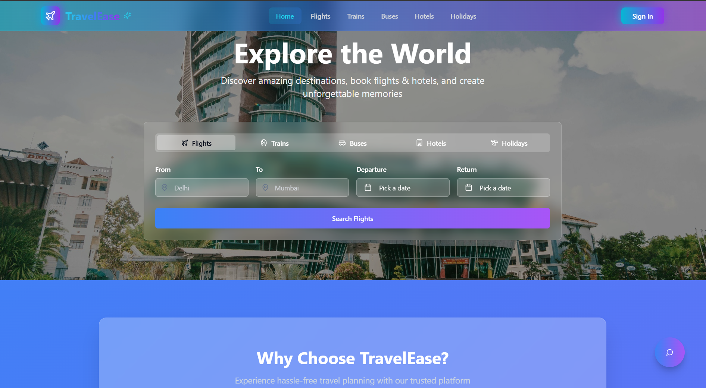

<h1>✈️ TravelEase — Intelligent Trip Planner</h1>
  <div align="center">
  
  <p>
    Your AI-powered travel companion to effortlessly plan, organize, and enjoy the perfect trip!<br>
    Built with the best of modern web and AI technologies.
  </p>
</div>

---

## 🌟 What is TravelEase?

**TravelEase** is a next-generation travel planning platform designed to simplify and enhance the way you organize your trips. Whether you're planning a weekend getaway or a global tour, TravelEase offers all the tools you need — right at your fingertips.

With AI-generated packing lists, smart destination discovery, budget estimators, and integrated hotel management, you’ll never miss a detail again. 🧳🌍

---

## ✨ Key Features

### 🏝️ Interactive Landing Pages
- Hero, About, Features, Contact sections  
- Testimonials, seasonal promotions, and curated holiday packages

### 🤖 AI-Powered Assistant
- Smart chatbot for real-time help, tips, and destination suggestions  
- Generates personalized packing checklists and itineraries  

### 🌍 Destination Explorer
- Sidebar + tabbed browsing by region  
- Visually rich destination cards with summaries  

### 🏨 Hotel Management
- Filter, search, view galleries, and compare ratings  
- Dedicated hotel pages for informed decisions  

### 📅 Trip Cost & Itinerary Planner
- Budget estimators and map-based itinerary builder  
- Add daily plans, visualize trips dynamically  

### 👥 User Engagement & Content
- Co-traveler invite & management  
- Personalized profiles, photo galleries, and reviews  
- Newsletter subscription for travel deals  

---

## 🧪 Tech Stack

| Technology       | Purpose                                         |
|------------------|--------------------------------------------------|
| **React** ⚛️        | Fast, component-based UI framework             |
| **TypeScript** 📘   | Type safety and better code maintainability    |
| **Vite** ⚡         | Lightning-fast development and build tools     |
| **Tailwind CSS** 🎨 | Utility-first CSS for rapid styling            |
| **Supabase** 🗃️     | Backend-as-a-service (Auth, DB, Storage)       |
| **ShadCN UI** 🧩    | Consistent, accessible UI components           |
| **Lucide Icons** 🌈 | Elegant and customizable icon library          |

---

## 📂 Project Structure

```bash
├── public/                   # Static assets
│   └── Lovable-picture/      # Cover/banner images
├── src/
│   ├── components/
│   │   ├── destination/      # Destination display logic
│   │   ├── holidays/         # Holiday promotions
│   │   ├── hotels/           # Hotel UI & details
│   │   └── ui/               # Shared UI components
│   ├── data/                 # Static and mock data
│   ├── hooks/                # Custom hooks
│   ├── integrations/         # Supabase & API integrations
│   ├── lib/                  # Helper modules
│   ├── pages/                # Route-level views
│   ├── utils/                # Utility functions
│   ├── App.tsx               # Main App component
│   └── main.tsx              # Vite entry point
├── supabase/                 # Supabase config (if used)
├── Modelfile                 # AI/ML configs (chatbot, checklist gen)
├── .gitignore
├── package.json
├── tsconfig.json
├── tailwind.config.ts
└── vite.config.ts
````

---

## ⚙️ Getting Started

### 🧑‍💻 Clone the Repo

```bash
git clone https://github.com/krishyadav90/Travelease-A-Trip-Planner.git
cd travelease
```

### 📦 Install Dependencies

```bash
npm install
```

### 🚀 Run Development Server

```bash
npm run start
```

Open `http://localhost:5173` in your browser to explore TravelEase locally!

---

## 🔐 Environment Setup

Create a `.env` file in your root with the following keys to connect Supabase:

```env
VITE_SUPABASE_URL=https://your-project.supabase.co
VITE_SUPABASE_ANON_KEY=your-anon-key
```

---

## 🤖 AI & Smart Modules

| File                            | Functionality                                  |
| ------------------------------- | ---------------------------------------------- |
| `ChatBot.tsx`                   | AI-powered travel assistant (OpenAI/LangChain) |
| `PackingChecklistGenerator.tsx` | Auto checklist creator per trip type           |
| `EnhancedProfile.tsx`           | Dynamic profile enrichment via AI              |

---

## 🧱 Build & Deploy

### Create Production Build:

```bash
npm run build
```

### Preview Build Locally:

```bash
npm run preview
```

### Deploy Easily On:

* 🔗 [Vercel](https://vercel.com/)
* 🌐 [Netlify](https://netlify.com/)
* 📦 Any host supporting static sites (e.g., Firebase Hosting)

---

## 🤝 Contribution Guide

We welcome all kinds of contributions! Follow these steps:

1. 🍴 Fork the repository
2. 🔧 Create a branch: `git checkout -b feature/my-feature`
3. 💬 Commit: `git commit -m 'Add amazing feature'`
4. 📤 Push: `git push origin feature/my-feature`
5. 📩 Open a pull request for review

---

## 📜 License

This project is licensed under the **MIT License**.
Check the full license in the [LICENSE](./LICENSE) file.

---

## 🙏 Acknowledgements

Thanks to the amazing tools and libraries that power this project:

* [Supabase](https://supabase.com/)
* [ShadCN UI](https://ui.shadcn.com/)
* [Tailwind CSS](https://tailwindcss.com/)
* [Lucide Icons](https://lucide.dev/)
* [OpenAI](https://platform.openai.com/) *(optional integration)*

---

## 📬 Contact the Team

For queries, feedback, or collaboration:

* 📧 \[[krishyada9865@gmail.com](mailto:krishyadav3866@gmail.com)]
* 📧 \[[anoopgurjar90@gmail.com](mailto:anoopgurjar90@gmail.com)]
* 📧 \[[aeshakul17@gmail.com](mailto:aeshakul17@gmail.com)]
* 📧 \[[deepikabhati207@gmail.com](mailto:deepikabhati207@gmail.com)]

---

> 🌍 **TravelEase** — Redefining the way you travel, with the power of intelligence and elegance.
> Built with 💙 by passionate developers.